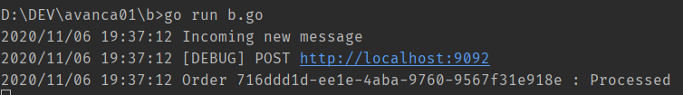
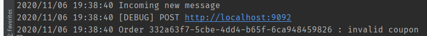
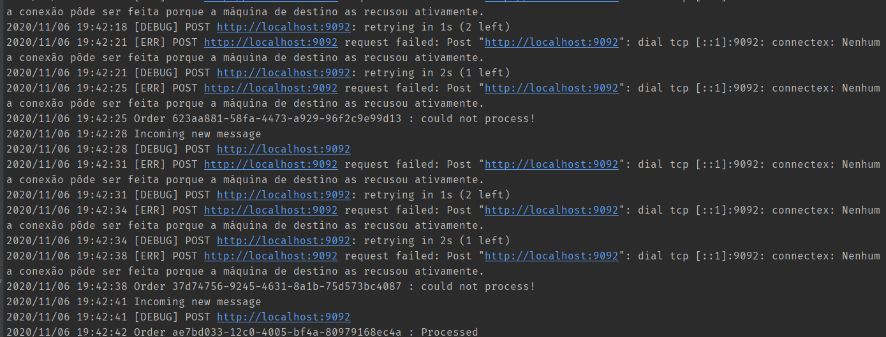

Repositório utilizado para as entregas de desafios do evento AvançaDev, feito pela Code.Education.

----------------------------------------------------------------------

Imagens dos serviços em fila. Segundo desafio da maratona.

Código de Coupon válido e serviços up:

Código de Coupon inválido:

Micro-serviço C fora do ar:

